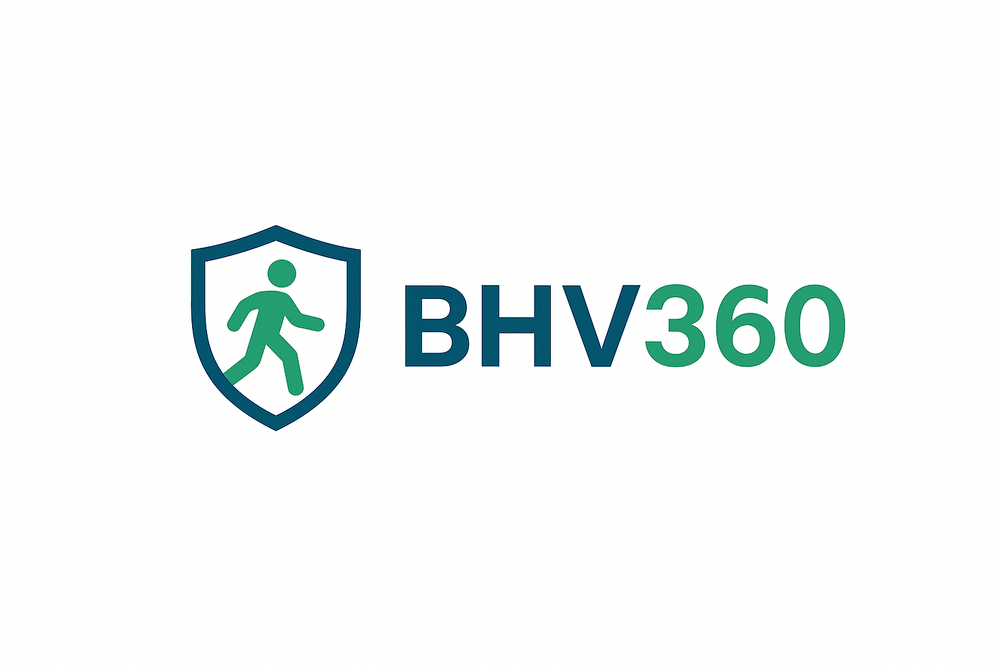

# 🚨 BHV360 - Complete BHV Management Platform

*Automatically synced with your [v0.dev](https://v0.dev) deployments*

**De meest complete BHV software voor Nederlandse bedrijven**

[🚀 Live Demo](https://bhv360.vercel.app) • [📖 Documentatie](./docs) • [🐛 Bug Report](https://github.com/jouwusername/bhv360/issues)

## Overview

This repository will stay in sync with your deployed chats on [v0.dev](https://v0.dev).
Any changes you make to your deployed app will be automatically pushed to this repository from [v0.dev](https://v0.dev).

## ✨ Features

### 🏢 **Multi-Tenant Architecture**
- **White-label oplossing** voor partners
- **Klant isolatie** met veilige data scheiding
- **Rol-gebaseerde toegang** (RBAC)
- **Freemium model** met upgrade paden

### 🚨 **Emergency Management**
- **Real-time incident tracking**
- **Multi-channel alerting** (Push, Email, SMS, Webhook)
- **Evacuation planning** met interactieve plattegronden
- **Emergency contact management**

### 👥 **BHV Beheer**
- **Certificering tracking** met vervaldatum alerts
- **Training scheduling** en reminder systeem
- **Skills assessment** en competentie matrix
- **Aanwezigheid registratie** via NFC/QR

### 📊 **Analytics & Reporting**
- **Performance dashboards** per rol
- **Compliance rapportage** voor audits
- **Custom PDF exports** met branding
- **Automated email reports**

### 🔧 **Technical Features**
- **PWA ready** met offline functionaliteit
- **Real-time synchronization** via WebSockets
- **Automated backups** met S3 integratie
- **Load testing** en performance monitoring

## 🚀 Quick Start

### 1️⃣ **Clone Repository**
\`\`\`bash
git clone https://github.com/jouwusername/bhv360.git
cd bhv360
npm install
\`\`\`

### 2️⃣ **Environment Setup**
\`\`\`bash
cp .env.example .env.local
# Vul je environment variabelen in
\`\`\`

### 3️⃣ **Database Setup**
\`\`\`bash
# Voor Supabase
npm run setup:supabase

# Voor Neon
npm run setup:neon
\`\`\`

### 4️⃣ **Start Development**
\`\`\`bash
npm run dev
\`\`\`

Bezoek [http://localhost:3000](http://localhost:3000) om de app te zien.

## 🔧 Environment Variables

📋 Complete lijst van environment variables

\`\`\`env
# Database
DATABASE_URL=postgresql://...
POSTGRES_URL=postgresql://...

# Authentication
AUTH_PASSWORD=your-secure-password
JWT_SECRET=your-jwt-secret

# Supabase (optioneel)
NEXT_PUBLIC_SUPABASE_URL=https://...
NEXT_PUBLIC_SUPABASE_ANON_KEY=eyJ...

# Notifications
NEXT_PUBLIC_VAPID_PUBLIC_KEY=BM...
VAPID_PRIVATE_KEY=your-vapid-private-key
SMTP_HOST=smtp.gmail.com

# Backup & Storage
BACKUP_API_KEY=your-backup-key
S3_BACKUP_BUCKET=bhv360-backups
S3_ACCESS_KEY_ID=your-s3-key
S3_SECRET_ACCESS_KEY=your-s3-secret

# External Services
SLACK_WEBHOOK_URL=https://hooks.slack.com/...
ESPA_SERVER_ADDRESS=your-espa-server
\`\`\`

## 📁 Project Structure

\`\`\`
bhv360/
├── app/                    # Next.js App Router
│   ├── api/               # API Routes
│   ├── beheer/            # Admin Dashboard
│   ├── bhv/               # BHV Management
│   └── dashboards/        # Role-based Dashboards
├── components/            # React Components
│   ├── ui/               # shadcn/ui Components
│   ├── admin/            # Admin Components
│   └── notifications/    # Notification Components
├── lib/                  # Utility Libraries
│   ├── auth/            # Authentication
│   ├── database/        # Database Adapters
│   ├── notifications/   # Notification Services
│   └── monitoring/      # Performance Monitoring
├── scripts/             # Database & Setup Scripts
└── docs/               # Documentation
\`\`\`

## Deployment

Your project is live at:

**[https://vercel.com/jeffrey-nachtegaals-projects/v0-bhv-360](https://vercel.com/jeffrey-nachtegaals-projects/v0-bhv-360)**

## Build your app

Continue building your app on:

**[https://v0.dev/chat/projects/XxCWMBOVRVB](https://v0.dev/chat/projects/XxCWMBOVRVB)**

## How It Works

1. Create and modify your project using [v0.dev](https://v0.dev)
2. Deploy your chats from the v0 interface
3. Changes are automatically pushed to this repository
4. Vercel deploys the latest version from this repository

## 🧪 Testing

\`\`\`bash
# Unit tests
npm run test

# E2E tests
npm run test:e2e

# Type checking
npm run type-check

# Linting
npm run lint
\`\`\`

## 📖 Documentation

- [🏗️ Architecture Overview](./docs/architecture.md)
- [🔐 Authentication Guide](./docs/authentication.md)
- [📊 Database Schema](./docs/database.md)
- [🚀 Deployment Guide](./DEPLOYMENT-GUIDE.md)
- [🔧 API Documentation](./docs/api.md)

## 🤝 Contributing

We verwelkomen bijdragen! Zie onze [Contributing Guide](./CONTRIBUTING.md) voor details.

1. Fork het project
2. Maak een feature branch (`git checkout -b feature/AmazingFeature`)
3. Commit je wijzigingen (`git commit -m 'Add some AmazingFeature'`)
4. Push naar de branch (`git push origin feature/AmazingFeature`)
5. Open een Pull Request

## 📄 License

Dit project is gelicenseerd onder de MIT License - zie het [LICENSE](LICENSE) bestand voor details.

## 🙏 Acknowledgments

- [Next.js](https://nextjs.org) - React framework
- [shadcn/ui](https://ui.shadcn.com) - UI components
- [Supabase](https://supabase.com) - Backend as a Service
- [Vercel](https://vercel.com) - Deployment platform

## 📞 Support

- 📧 Email: support@bhv360.nl
- 💬 Discord: [BHV360 Community](https://discord.gg/bhv360)
- 🐛 Issues: [GitHub Issues](https://github.com/jouwusername/bhv360/issues)

---

Made with ❤️ for Dutch BHV professionals

